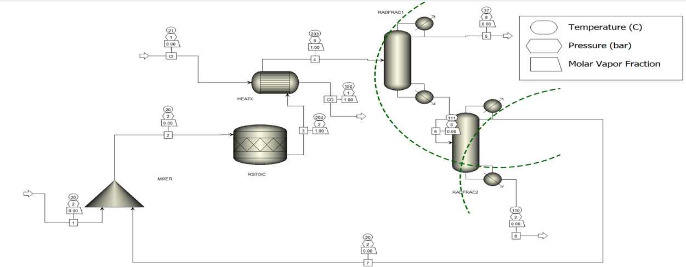

# Dimethyl Ether (DME) Production Process Simulation

## Project Overview

This project focuses on the simulation and analysis of Dimethyl Ether (DME)
production from methanol using Aspen Plus V14.

The process integrates reaction, heat transfer, distillation, recycle,
sensitivity analysis, pinch analysis, and techno-economic analysis.

## Process Reaction

**2 CH₃OH → CH₃–O–CH₃ + H₂O**

Catalyst: Acid Zeolite

## Process Flowsheet

The simulated process consists of a mixer, RSTOIC reactor, heat exchanger,
and two RADFRAC distillation columns. Unreacted methanol is recovered and
recycled back to the process.

## Simulation Details

- **Software:** Aspen Plus V14
- **Thermodynamic Model:** NRTL
- **Reactor:** RSTOIC
- **Heat Exchanger:** HEATX
- **Separation:** RADFRAC distillation columns
- **Process:** Methanol dehydration to DME
- **Heat Integration:** Aspen Energy Analyzer

## Key Results

- Methanol feed: **438.51 kmol/hr**
- Methanol conversion: **80%**
- DME production: **216.99 kmol/hr**
- Final DME purity: **100 mol%**
- Methanol recycle: **103.96 kmol/hr**

## Sensitivity Analysis

Sensitivity analysis was performed to study the effect of operating
parameters on process performance.

### Reflux Ratio

The effect of reflux ratio on DME purity and reboiler duty was investigated
for the distillation process.

### Distillate Rate

The effect of distillate rate on DME purity and separation performance
was also analyzed.

## Pinch Analysis

Aspen Energy Analyzer was used to investigate heat integration and
heat-recovery opportunities.

- ΔTmin: **10°C**
- Heat recovery opportunity: **1.198 Gcal/hr**

## Techno-Economic Analysis

The project also included an economic evaluation considering:

- Capital expenditure (CAPEX)
- Operating expenditure (OPEX)
- Utility costs
- Revenue
- Profitability
- Payback period
- Methanol price sensitivity

## Engineering Concepts

This project involved the application of:

- Chemical Reaction Engineering
- Thermodynamics
- Vapor-Liquid Equilibrium
- Distillation
- Heat Transfer
- Process Simulation
- Recycle and Convergence
- Sensitivity Analysis
- Pinch Analysis
- Process Economics

## Project Files

### Project Report
Detailed documentation of the process simulation, analysis,
and results.

[View Project Report](DME_Project_Report.pdf)

### Project Presentation
Presentation containing the process flowsheet, simulation results,
sensitivity analysis, pinch analysis, and economic analysis.

[View Project Presentation](DME_Project_Presentation.pdf)

## Future Improvements

- Replace the RSTOIC reactor with a kinetic reactor using experimental
  catalyst kinetics.
- Develop a heat exchanger network based on pinch targets.
- Perform rigorous heat exchanger rating.
- Incorporate process control and further process optimization.
